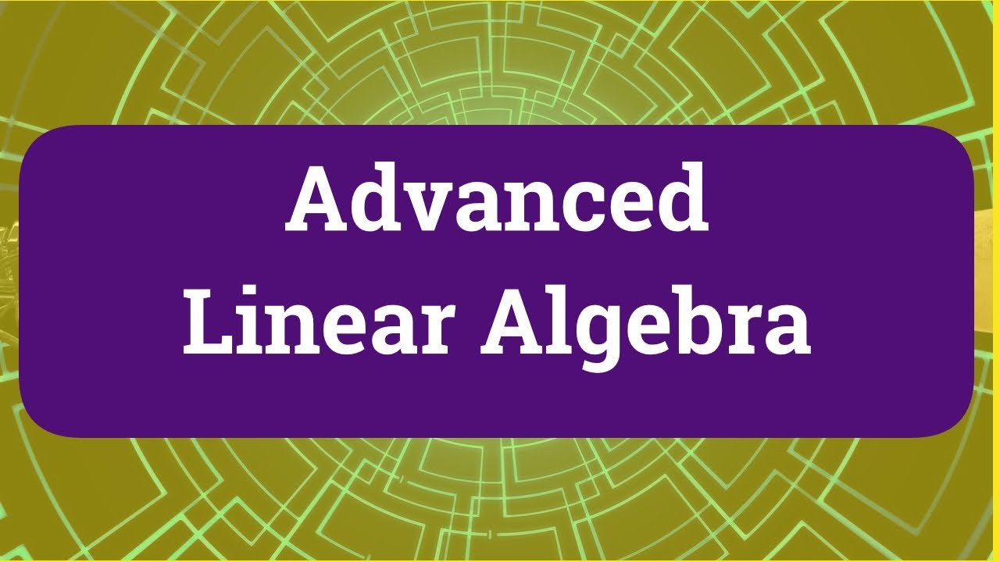

# **Advanced Linear Algebra Calculator**


---

## **Table of Contents**
1. [About Me](#about-me)
2. [Project Description](#project-description)
3. [Development Journey](#development-journey)
4. [Challenges & Lessons Learned](#challenges--lessons-learned)
5. [Features Implemented](#features-implemented)
6. [How to Run the Project](#how-to-run-the-project)
7. [Contributing](#contributing)
8. [Contact](#contact)
---

## **About Me**  
I'm **[Davy](https://github.com/Giang-Davy)**, a developer with a passion for mathematics and computer science. I enjoy solving complex problems through algorithmic approaches. You can follow me on **[Linkedlin](https://www.linkedin.com/in/davy-dang-vu-956059322/)**.

---

## **Project Description**  
The **Advanced Linear Algebra Calculator** is an application that allows you to perform advanced matrix calculations such as:

- **Determinant calculation**
- **Minor and cofactor calculation**
- Solving **linear systems** (e.g., using matrix inversion or Gaussian elimination)
- **Eigenvalue** and **eigenvector** calculation
- Matrix **inversion** and other matrix operations

The goal of this project is to provide a simple interface for performing complex linear algebra calculations without the need for a heavy mathematical library like **NumPy**. This project is particularly useful for students, researchers, or anyone who wants to understand and visualize linear algebra concepts in a practical way.

---

## **Development Journey**  
This project started as a way to deeply understand **linear algebra** and apply its principles in an algorithmic context. Initially, I wanted to create a tool that could perform basic matrix calculations. Over time, I expanded its functionality to cover advanced operations, focusing on:

- Implementing **matrix manipulation algorithms** such as Gaussian elimination and matrix inversion
- Working with **Eigenvalues** and **Eigenvectors** for solving real-world problems like optimization
- Incorporating features for advanced matrix operations while keeping the project simple and efficient

Key milestones during development:
- ✅ Implemented **determinant** and **minor/cofactor calculation**
- ✅ Developed **matrix inversion algorithms**
- 🔄 Still working on **support for larger matrices and optimization algorithms**
- 🚀 Future plans include **adding more matrix decomposition techniques like LU and QR decomposition**

---

## **Challenges & Lessons Learned**  
One of the most challenging aspects of this project was implementing **matrix inversion** without relying on third-party libraries. I spent a lot of time researching various methods, like **Gaussian elimination** and **Cramer's rule**, to ensure the implementation was both efficient and numerically stable. I also encountered difficulties with **eigenvalue decomposition** and needed to refine my understanding of **linear algebra theory** to implement the algorithm correctly.

During this process, I learned a lot about **numerical methods** and the importance of stability when working with large matrices. The project has helped me improve my problem-solving skills and deepened my understanding of both **math** and **software development**.

---

## **Features Implemented**
- Calculating the **determinant** of a matrix
- Finding **minors** and **cofactors**
- **Matrix inversion** using Gaussian elimination
- Solving **linear systems of equations**
- **Eigenvalue** and **eigenvector** computation

---
## **How to Run the Project**
1. Clone this repository:  
   ```bash
   git clone ../advanced_linear_algebra
   
2. Change your directory to the project folder:
   ```bash
   cd advanced_linear_algebra
3. Install dependencies:
   If there is a requirements.txt file (for Python dependencies), run:
   ```bash
   pip install -r requirements.txt
If you're using a virtual environment, activate it first:
   ```bash
# On Linux/macOS
source venv/bin/activate

# On Windows
venv\Scripts\activate
